# Estimation-of-Change-Point-Detection-Algorithms

# Change Point Detection in Mean Using R

This repository contains a collection of R scripts that perform change point detection on simulated time series data. The primary focus is on detecting changes in the mean using the `cpt.mean` function from the [changepoint](https://cran.r-project.org/web/packages/changepoint/index.html) package. The scripts include examples for multiple change point (MCP) detection and single change point (SCP) detection using different detection methods and penalty criteria.

## Repository Structure

- **PBS-SCP-MEAN.R**  
  - **Purpose:**  
    Focuses on single change point (SCP) detection scenarios.  
  - **Highlights:**  
    - Simulates data with two segments (one change point).
    - Implements single change point detection functions using both BinSeg and PELT (with Q set to 1).
    - Provides repeated simulation functions and sensitivity analyses (with and without MAD normalization).
    - Generates sensitivity plots and visualizations for single change point detection under different noise conditions.
    <table>
  <tr>
    <td></td>
    <td>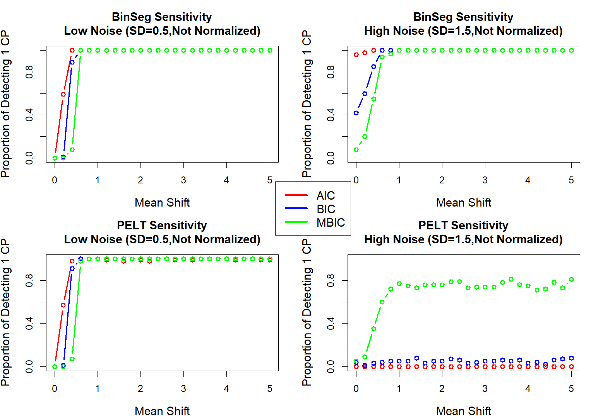</td>
    <td>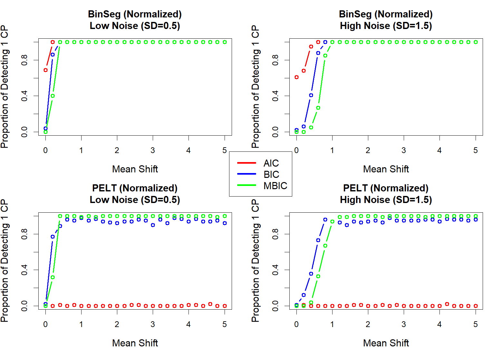</td>
  </tr>
</table>


- **PBS-MCP-MEAN.R**  
  - **Purpose:**  
    Provides a more extensive simulation framework for multiple change point detection with sensitivity analysis.  
  - **Highlights:**  
    - Simulates data with four segments (multiple change points).
    - Contains functions for repeated simulation:
      - Both for unnormalized data and for data normalized using MAD normalization.
    - Implements sensitivity analysis by varying the magnitude of the mean shift.
    - Generates multiple 2×2 plots comparing the performance of penalty methods (AIC, BIC, MBIC) under different noise conditions (low vs. high noise).
    - Provides example plots of time series with overlaid change points for visual inspection.
     <table>
  <tr>
    <td>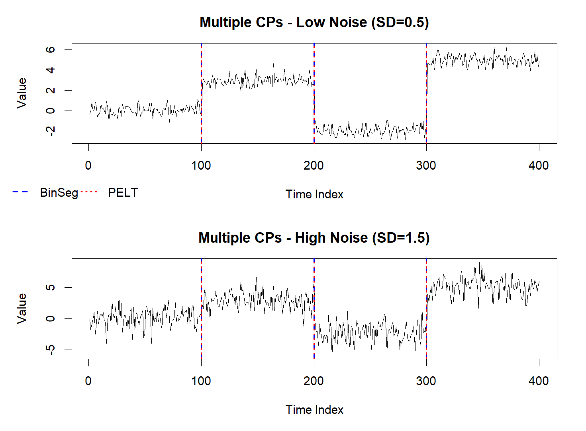</td>
    <td>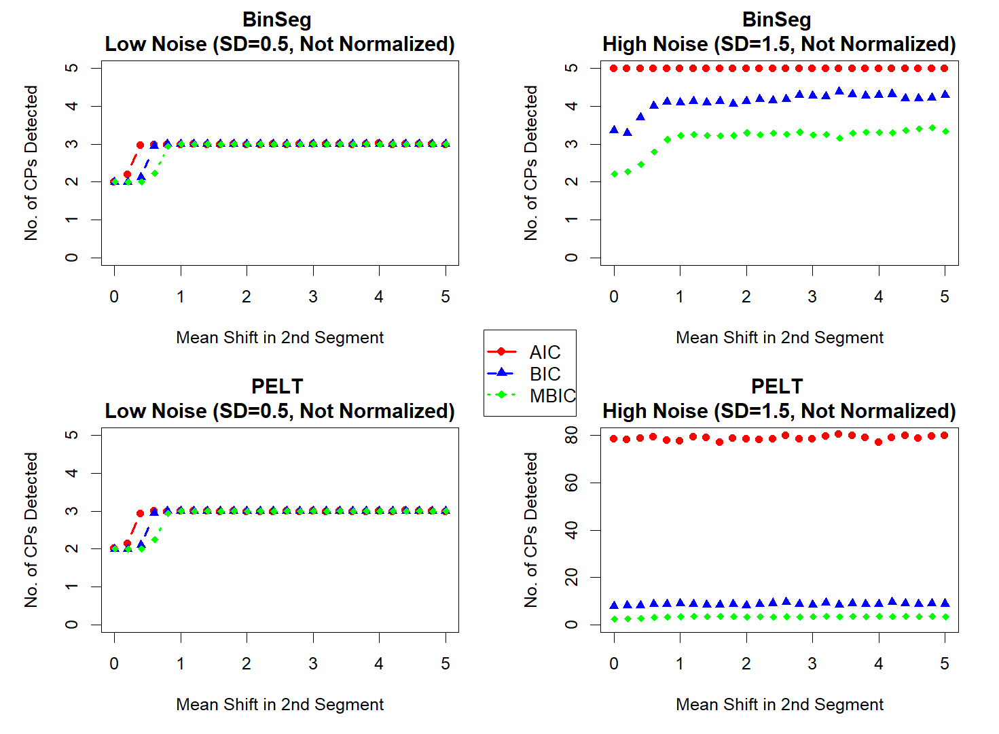</td>
    <td>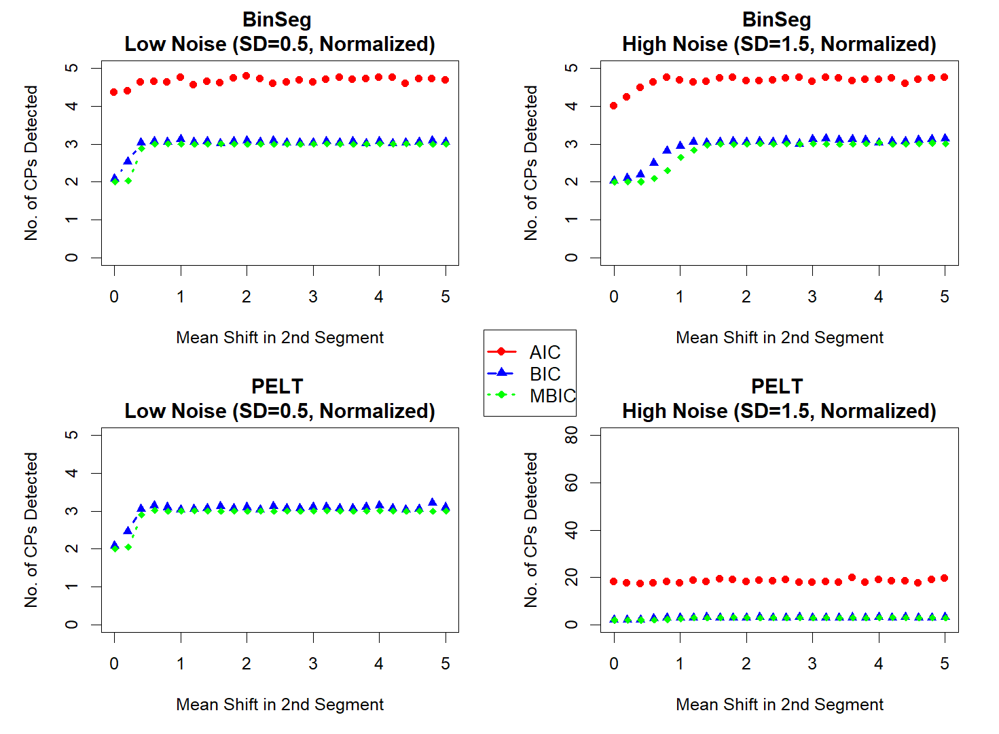</td>
  </tr>
</table>


- **PBS-MCP2.R**  
  - **Purpose:**  
    Focuses on the detection of two closely spaced change points.  
  - **Highlights:**  
    - Simulates a series with two close mean shifts.
    - Uses repeated simulations to evaluate the performance of BinSeg and PELT methods.
    - Performs sensitivity analysis over a range of gap values between change points.
    - Plots:
      - The fraction of runs where both change points are detected.
      - The average number of detected change points versus the gap value.
    - Includes an example visualization of detected change points on a single simulated time series.
   <table>
  <tr>
    <td>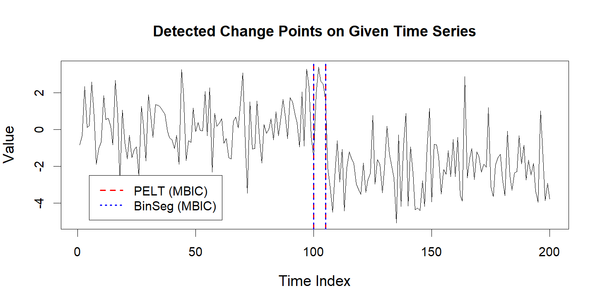</td>
    <td>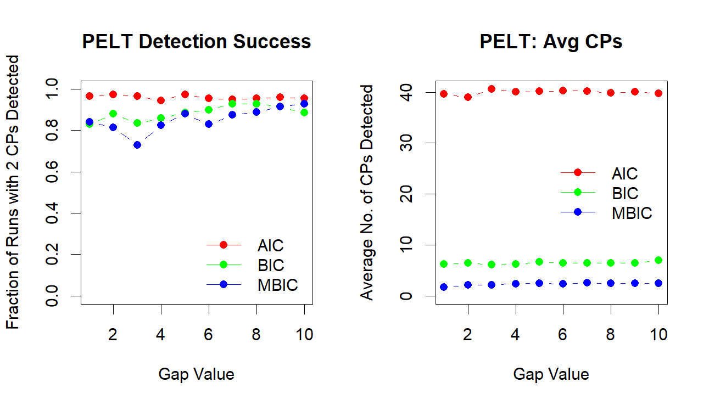</td>
    <td>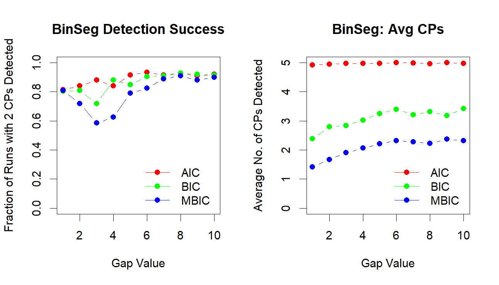</td>
  </tr>
</table>

## Change in Variance Analysis using `cpt.var`

This repository now includes scripts to test change in variance using the `cpt.var` function from the [changepoint](https://cran.r-project.org/web/packages/changepoint/index.html) package. In these scripts, synthetic time series data is generated with constant mean but varying variance. The variance shift is then detected using both the PELT and BinSeg methods.

### Code Overview

1. **Data Generation:**  
   The scripts generate data with specified segment lengths, constant means, and differing standard deviations. In the variance analysis, the means are kept constant while the standard deviation changes to simulate a variance shift.

2. **Detection Functions:**  
   - **PELT Detection:**  
     The function `detect_pelt` (or `detect_pelt_crops` in PBS-SCP-VAR) applies the `cpt.var` function with the PELT method using a specified penalty (e.g., AIC, BIC, or MBIC).  
     ```r
     fit <- cpt.var(data, method = "PELT", penalty = "BIC")
     cpts(fit)  # Extracts the change point indices
     ```
   - **BinSeg Detection:**  
     Similarly, `detect_binseg` (or `detect_binseg_crops` in PBS-SCP-VAR) applies the `cpt.var` function with the BinSeg method.  
     ```r
     fit <- cpt.var(data, method = "BinSeg", penalty = "BIC")
     cpts(fit)
     ```

3. **Simulation and Sensitivity Analysis:**  
   The scripts include repeated simulations to evaluate the average number of detected change points as the standard deviation in one segment is varied. This sensitivity analysis helps compare the performance of different penalty methods (AIC, BIC, MBIC) under various noise conditions.

4. **Plotting:**  
   The scripts generate plots that:
   - Show the detected change points (CP) overlaid on the time series.
   - Illustrate the sensitivity of the methods to changes in variance.
   These plots are automatically saved as PNG images.

### Automatically Embedding Generated Plots

The images generated from the variance analyses are saved in the `IMAGES` folder. Below are HTML tables that embed the plots in a side-by-side layout:

#### PBS-SCP-VAR (Single Change Point Variance)
<table>
  <tr>
    <td align="center">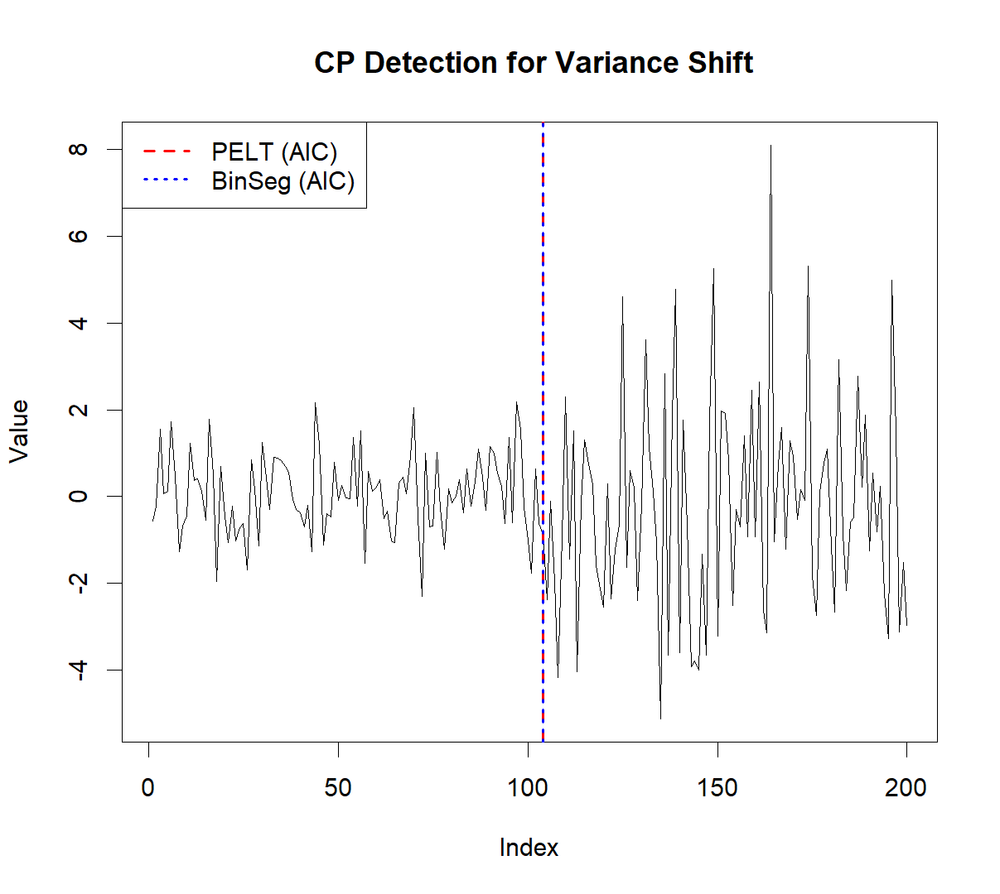</td>
    <td align="center">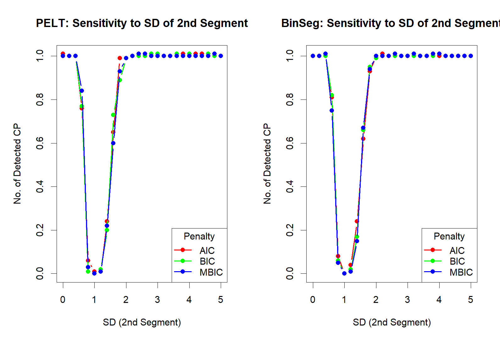</td>
  </tr>
  <tr>
    <td align="center" colspan="2"><strong>PBS-SCP-VAR Results</strong></td>
  </tr>
</table>

#### PBS-MCP-VAR (Multiple Change Point Variance)
<table>
  <tr>
    <td align="center">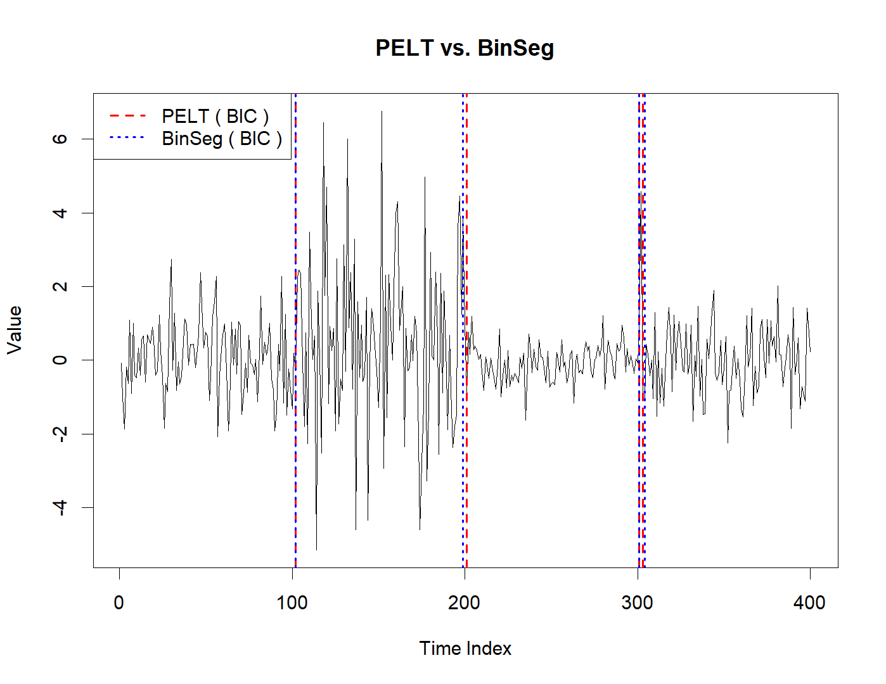</td>
    <td align="center">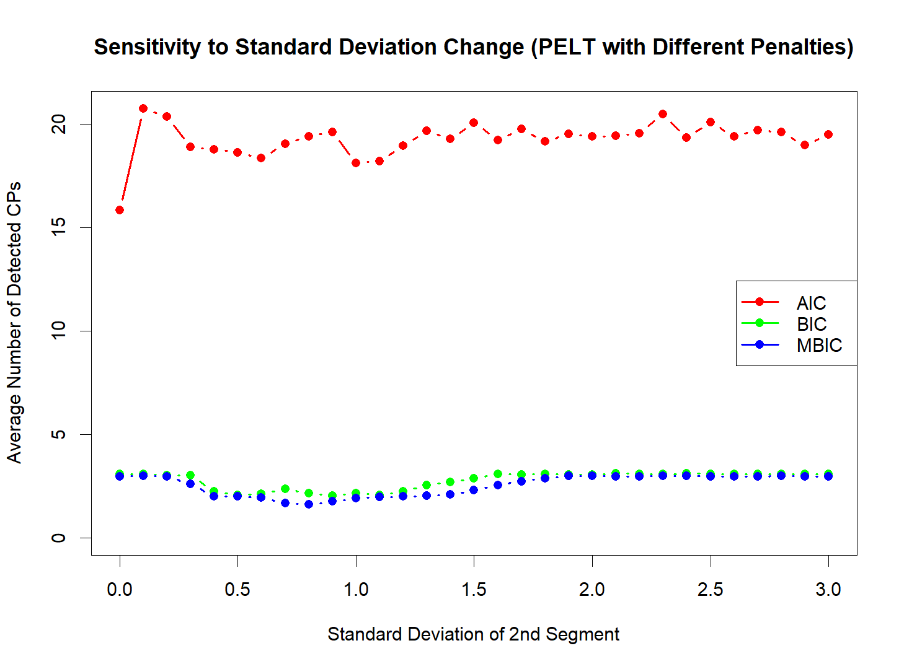</td>
    <td align="center">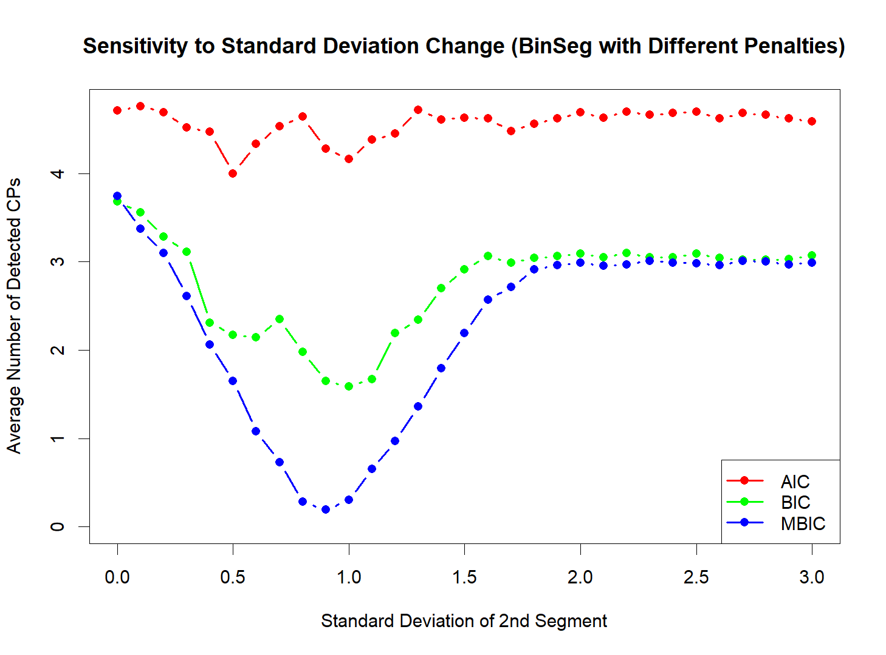</td>
  </tr>
  <tr>
    <td align="center" colspan="3"><strong>PBS-MCP-VAR Results</strong></td>
  </tr>
</table>


## Prerequisites

Ensure that you have R (version 3.5 or later) installed along with the following package:

- **changepoint**  
  Install using:
  ```r
  install.packages("changepoint")
