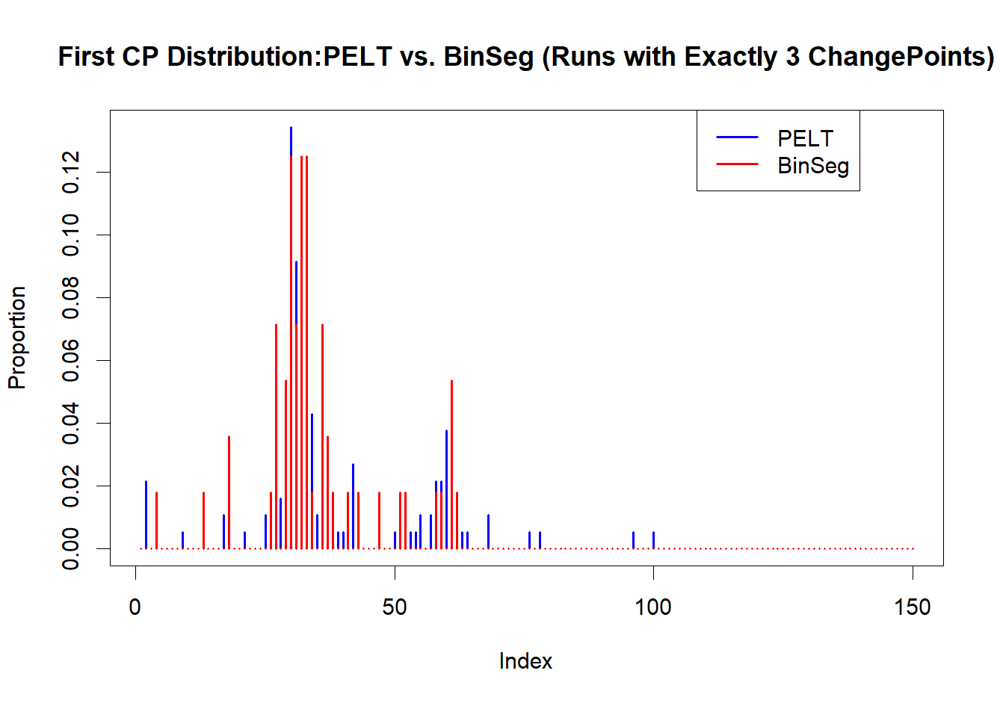

# Estimation-of-Change-Point-Detection-Algorithms

## Simulation Study for Change Point Detection in Time Series

This repository comprises a collection of R scripts developed as part of my dissertation to rigorously evaluate change point detection methodologies in time series analysis. In our simulation study, we generate synthetic piecewise-stationary processes with predetermined structural breaks and employ statistical criteria to infer abrupt changes in the underlying parameters. Specifically, we consider three families of methods:
1. **Change in Mean Detection** using `cpt.mean`

   This method assumes that the time series consists of segments where the average value (mean) is constant within each segment, but may shift abruptly at unknown points. The goal is to identify these shifts in the mean. The detection is guided by information criteria such as AIC, BIC, or MBIC, which help balance the complexity of the model (i.e., the number of segments) against how well the model fits the data.

---

2. **Change in Variance Detection** using `cpt.var`

   In this approach, the time series is modeled with a constant average level across all observations, but the variability (variance) is allowed to differ between segments. The objective is to detect changes in the spread or volatility of the data. The method identifies points in time when the dispersion of the series changes, even if the average value remains the same.

---

3. **Change in Mean and Variance Detection** using `cpt.meanvar`

   This method generalizes the previous two approaches by allowing both the average value and the variability to change between segments. It is used when there is evidence that both the level and the volatility of the time series are subject to abrupt changes. The algorithm simultaneously estimates the breakpoints along with the mean and variance for each segment.

---

### Repository Structure

- **PBS-SCP-MEAN.R**  
  - **Purpose:** Single change point (SCP) detection in mean.  
  - **Highlights:**  
    - Simulates a bi-segmental time series with one mean shift.
    - Implements SCP detection via `cpt.mean` using both PELT and BinSeg (with \(Q = 1\)).
    - Includes repeated simulation and sensitivity analysis (with and without MAD normalization) to evaluate detection performance.
  - **Example Code:**  
    ```r
    fit <- cpt.mean(data_vector, method = "PELT", penalty = "BIC")
    cpts(fit)  # Extracts the change point index
    ```
  - **Plots:**  
    <table>
      <tr>
        <td></td>
        <td></td>
        <td></td>
      </tr>
    </table>
    *Figure: SCP detection in mean using both standard and MAD-normalized data.*

- **PBS-MCP-MEAN.R**  
  - **Purpose:** Multiple change point (MCP) detection in mean.  
  - **Highlights:**  
    - Simulates a time series with four segments exhibiting distinct mean shifts.
    - Contains functions for repeated simulations and sensitivity analysis by varying the magnitude of mean shifts under different noise regimes.
    - Generates comparative 2×2 plots to assess performance across penalty criteria (AIC, BIC, MBIC).
  - **Example Code:**  
    ```r
    fit <- cpt.mean(data_vector, method = "BinSeg", penalty = "MBIC", Q = 15)
    cpts(fit)
    ```
  - **Plots:**  
    <table>
      <tr>
        <td></td>
        <td></td>
        <td></td>
      </tr>
    </table>
    *Figure: MCP detection in mean with sensitivity analysis.*

- **PBS-MCP2.R**  
  - **Purpose:** Detection of two closely spaced change points in mean.  
  - **Highlights:**  
    - Simulates data with two adjacent mean shifts.
    - Uses repeated simulations to assess the probability of detecting both change points and plots the average number of detected CPs versus the gap between them.
  - **Example Code:**  
    ```r
    sim_res <- simulate_two_close_cps_pelt(times = 100, n = 200, first_cp = 100, gap = 5, penalty = "MBIC")
    mean(sim_res$separated_2cps)
    ```
  - **Plots:**  
    <table>
      <tr>
        <td></td>
        <td></td>
        <td></td>
      </tr>
    </table>
    *Figure: Detection of two closely spaced CPs in mean.*

- **PBS-SCP-VAR.R**  
  - **Purpose:** Single change point detection in variance.  
  - **Highlights:**  
    - Simulates a bi-segmental time series with a variance shift (constant mean).
    - Uses `cpt.var` with both PELT and BinSeg to detect structural breaks in variance.
  - **Example Code:**  
    ```r
    fit <- cpt.var(data_vector, method = "PELT", penalty = "BIC")
    cpts(fit)
    ```
  - **Plots:**  
    <table>
      <tr>
        <td align="center"></td>
        <td align="center"></td>
      </tr>
      <tr>
        <td align="center" colspan="2"><strong>PBS-SCP-VAR Results</strong></td>
      </tr>
    </table>

- **PBS-MCP-VAR.R**  
  - **Purpose:** Multiple change point detection in variance.  
  - **Highlights:**  
    - Simulates a time series with four segments with differing variances.
    - Conducts repeated simulations and sensitivity analysis to study variance shifts.
  - **Example Code:**  
    ```r
    fit <- cpt.var(data_vector, method = "BinSeg", penalty = "BIC", Q = 5)
    cpts(fit)
    ```
  - **Plots:**  
    <table>
      <tr>
        <td align="center"></td>
        <td align="center"></td>
        <td align="center"></td>
      </tr>
      <tr>
        <td align="center" colspan="3"><strong>PBS-MCP-VAR Results</strong></td>
      </tr>
    </table>

- **PBS-SCP-MEANVAR.R**  
  - **Purpose:** Single change point detection in both mean and variance.  
  - **Highlights:**  
    - Simulates a bi-segmental time series with simultaneous changes in mean and variance.
    - Uses `cpt.meanvar` with PELT and BinSeg for joint estimation of change points, segment means, and variances.
    - Performs sensitivity analyses by varying the magnitude of mean and variance shifts.
  - **Example Code:**  
    ```r
    fit <- cpt.meanvar(data_vector, method = "PELT", penalty = "MBIC")
    cpts(fit)
    param.est(fit)$mean      # Estimated means
    param.est(fit)$variance  # Estimated variances
    ```
  - **Plots:**  
    <table>
      <tr>
        <td align="center">
          
        </td>
      </tr>
      <tr>
        <td align="center"><strong>PBS-SCP-MEANVAR Results</strong></td>
      </tr>
    </table>

- **PBS-MCP-MEANVAR-EST.R**  
  - **Purpose:** Multiple change point detection in both mean and variance.  
  - **Highlights:**  
    - Simulates a multi-segment time series (4 segments with 3 true change points) with changes in both mean and variance.
    - Conducts an extensive simulation study (e.g., \(N = 1000\)) to assess detection frequency and parameter estimation accuracy.
    - Summarizes distributions of estimated segment means, variances, and change point locations.
  - **Example Code:**  
    ```r
    fit_pelt <- cpt.meanvar(x, method = "PELT")
    cpts(fit_pelt)
    param.est(fit_pelt)$mean
    param.est(fit_pelt)$variance
    ```
  - **Plots:**  
    <table>
      <tr>
        <td align="center">
          
        </td>
        <td align="center">
          
        </td>
      </tr>
      <tr>
        <td align="center" colspan="2"><strong>Multiple Change Points in Mean and Variance: BinSeg vs. PELT</strong></td>
      </tr>
      <tr>
        <td align="center" colspan="2">
          
        </td>
      </tr>
      <tr>
        <td align="center" colspan="2"><strong>Distribution of Estimated CP Locations</strong></td>
      </tr>
    </table>

---

### How to Run the Simulation Study

These R scripts were implemented as part of a rigorous simulation study to evaluate change point detection methods. In our study, we generate piecewise-stationary time series data with known structural breaks and apply segmentation algorithms to estimate the locations and parameters of these breaks. The methodologies are grounded in likelihood-based inference and information criteria, balancing model fit and complexity.

---

## Change Point Detection within Bitcoin Prices

This section of the repository applies advanced change point detection methodologies to real-world Bitcoin price data. The analysis spans the period from 2014 to 2021 and investigates structural breaks in the price dynamics using multiple approaches. In our study, we rigorously test for abrupt changes in the statistical properties of Bitcoin returns by leveraging likelihood‐based segmentation techniques under different model specifications. In particular, we explore:

- **Raw Log Returns Analysis:** Direct segmentation on the logarithmic returns of Bitcoin, where the focus is on detecting shifts in the central tendency and dispersion of the returns.
- **EGARCH Modeling:** Fitting an Exponential GARCH(1,1) model to capture volatility clustering and then applying change point detection to the standardized residuals to reveal structural breaks in the volatility process.
- **Frequency-Based Analysis:** Conducting CPD on data aggregated at different frequencies (weekly and monthly) to examine how the temporal resolution impacts the detection of regime changes.
- **Exploratory Analysis:** Performing an extensive exploratory analysis that includes the computation of descriptive statistics, rolling metrics, and autocorrelation functions, which provide essential insights into the underlying dynamics of Bitcoin prices.

### Overview of the Analysis

1. **Data Preparation:**  
   Bitcoin closing prices are imported from a CSV file and converted into an xts time series object. The dataset is then restricted to the period from January 1, 2014, to December 31, 2021. Log returns are computed at daily, weekly, and monthly frequencies, providing multiple perspectives on the temporal evolution of the price process.

2. **Raw Model CPD and Diagnostics (BS-BTC-EGARCH.R):**  
   - **Raw Log Returns:**  
     The weekly log returns are computed from the closing prices, thereby transforming the non-stationary price series into a stationary return series.
   - **Change Point Detection:**  
     Structural breaks in the raw log returns are identified using the `cpt.meanvar` function with the BinSeg algorithm. An AIC penalty is applied and the model is constrained to detect up to 5 change points. This method balances the log-likelihood improvement with model parsimony.
   - **Diagnostics:**  
     A battery of statistical tests is applied, including the Augmented Dickey-Fuller (ADF) test for stationarity, KPSS test for level stationarity, Ljung-Box test for autocorrelation, ARCH test for heteroskedasticity, and Jarque-Bera test for normality. These diagnostics rigorously assess the validity of the underlying model assumptions.
   - **EGARCH Modeling:**  
     To account for volatility clustering, an EGARCH(1,1) model is fitted using the `rugarch` package. The standardized residuals extracted from the model serve as inputs to further CPD analysis, thereby isolating structural shifts that are not attributable to conditional heteroskedasticity.
     
   **Resulting Plots:**
   <table>
     <tr>
       <td align="center">
         
       </td>
     </tr>
     <tr>
       <td align="center" colspan="2"><strong>EGARCH Analysis: Change Point Detection on Raw Log Returns and on EGARCH Standardized Residuals</strong></td>
     </tr>
   </table>

3. **Weekly Analysis (BS-BTC-WEEKLY.R):**  
   - **Weekly Series Construction:**  
     The daily closing prices are aggregated into a weekly time series by selecting the closing price of the first trading day of each week. Weekly log returns are then computed.
   - **Change Point Detection:**  
     The `cpt.meanvar` function is applied to the weekly returns using the BinSeg method with an AIC penalty and a pre-specified number of change points. This segmentation facilitates the identification of structural breaks on a weekly time scale.
   - **Custom Timeline Plot:**  
     A custom x-axis is constructed to display tick marks corresponding to calendar years (2014–2021), enhancing the interpretability of the change point locations in a temporal context.
     
   **Resulting Plot:**
   <table>
     <tr>
       <td align="center">
         
       </td>
     </tr>
     <tr>
       <td align="center"><strong>Weekly Analysis: Change Point Detection on Bitcoin Weekly Log Returns</strong></td>
     </tr>
   </table>

4. **Exploratory Analysis (BTC-EXPLORATORY.R):**  
   - **Descriptive Statistics:**  
     The script computes key summary statistics—mean, variance, skewness, and kurtosis—for daily, weekly, and monthly returns, offering a comprehensive statistical profile of Bitcoin's return distribution.
   - **Rolling Metrics:**  
     A 30-day rolling average and a rolling standard deviation (volatility) are calculated to reveal underlying trends and the temporal evolution of risk.
   - **Distribution and ACF Plots:**  
     Histograms, QQ plots, and autocorrelation function (ACF) plots are generated to assess the empirical distribution and temporal dependence in the return series.
   - **Stationarity Testing:**  
     An Augmented Dickey-Fuller test is conducted on the price series to confirm the presence of stationarity after transformation to returns.
     
   **Resulting Plots:**
   <table>
     <tr>
       <td align="center">
         
       </td>
       <td align="center">
         
       </td>
     </tr>
     <tr>
       <td align="center">
         
       </td>
       <td align="center">
         
       </td>
     </tr>
     <tr>
       <td align="center" colspan="2">
         <strong>EGARCH Analysis: Change Point Detection on Raw Log Returns, EGARCH Standardized Residuals, and Diagnostic Plots</strong>
       </td>
     </tr>
   </table>

5. **Monthly Analysis (PBS-BTC-monthly.R) & Weekly Analysis (PBS-BTC-weekly.R):**  
   - **Frequency-Based CPD:**  
     The monthly and weekly time series are constructed from the daily data, and logarithmic returns are computed. Two CPD methods are then employed:
       - **Method A (BinSeg):** Implements a Manual penalty with a pre-defined maximum number of change points.
       - **Method B (PELT):** Utilizes the CROPS penalty, which allows the model to adaptively choose the optimal number of change points.
   - **Plotting with Custom Labels:**  
     The resulting plots overlay the detected change points on the return series and feature a custom x-axis that displays dates (formatted as Month-Year).
   - **Output:**  
     The estimated change point dates are printed to the console for further analysis.
     
   **Resulting PELT Diagnostic (Elbow) Plot:**
   <table>
     <tr>
       <td align="center">
         
       </td>
     </tr>
     <tr>
       <td align="center">
         <strong>Diagnostic Elbow Plot for PELT Change Point Detection</strong>
       </td>
     </tr>
   </table>
     
   **Resulting Monthly Plot:**
   <table>
     <tr>
       <td align="center">
         
       </td>
       <td align="center">
         
       </td>
     </tr>
     <tr>
       <td align="center" colspan="2"><strong>Monthly Analysis: Change Point Detection and Diagnostics on Bitcoin Log Returns</strong></td>
     </tr>
   </table>
   
   **Resulting Weekly Plot:**
   <table>
     <tr>
       <td align="center">
         
       </td>
       <td align="center">
         
       </td>
     </tr>
     <tr>
       <td align="center" colspan="2">
         <strong>Weekly Analysis: Change Point Detection and Diagnostics on Bitcoin Log Returns</strong>
       </td>
     </tr>
   </table>

---

Each script implements rigorous statistical procedures, underpinned by likelihood-based inference and information criteria, to detect structural breaks in Bitcoin returns. The CPD results are further validated through diagnostic tests and visualized with custom plots that align the change points with calendar dates.

   
---


## Prerequisites

To run the simulation study and Bitcoin price analysis, ensure you have R (version 3.5 or later) installed. The following R packages are required. If any package is not already installed, you can install them using the commands below:

- **changepoint** – For change point detection methods (`cpt.mean`, `cpt.var`, `cpt.meanvar`).
  ```r
  install.packages("changepoint")
