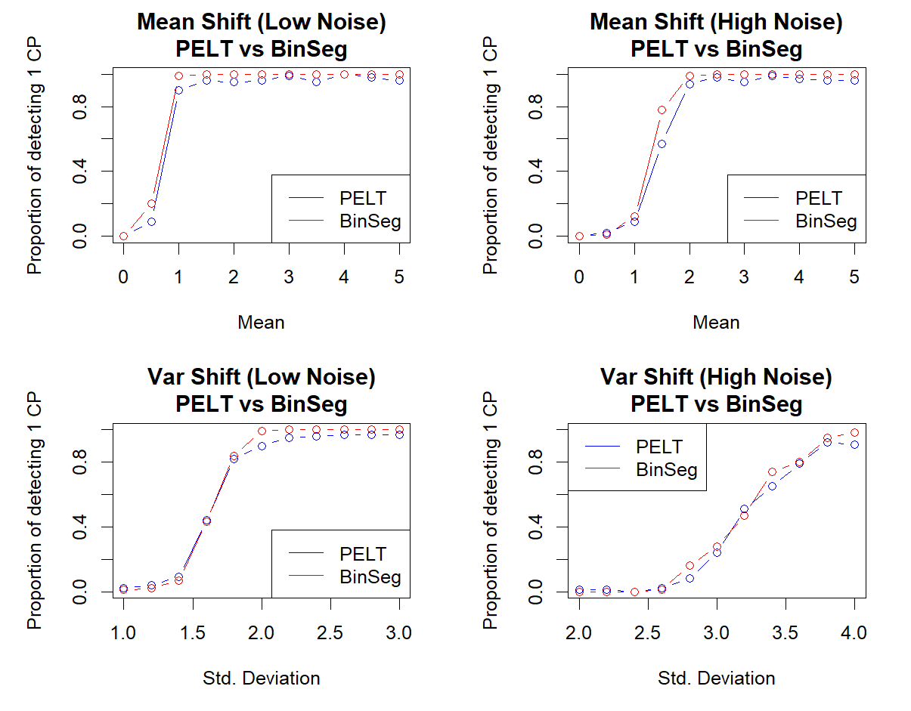
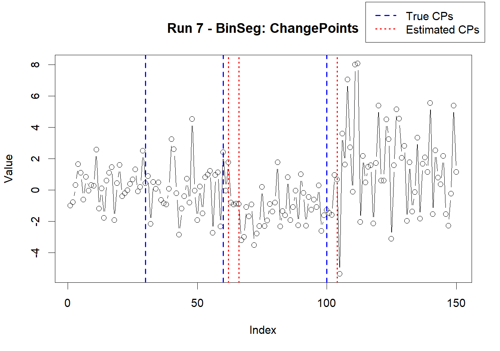
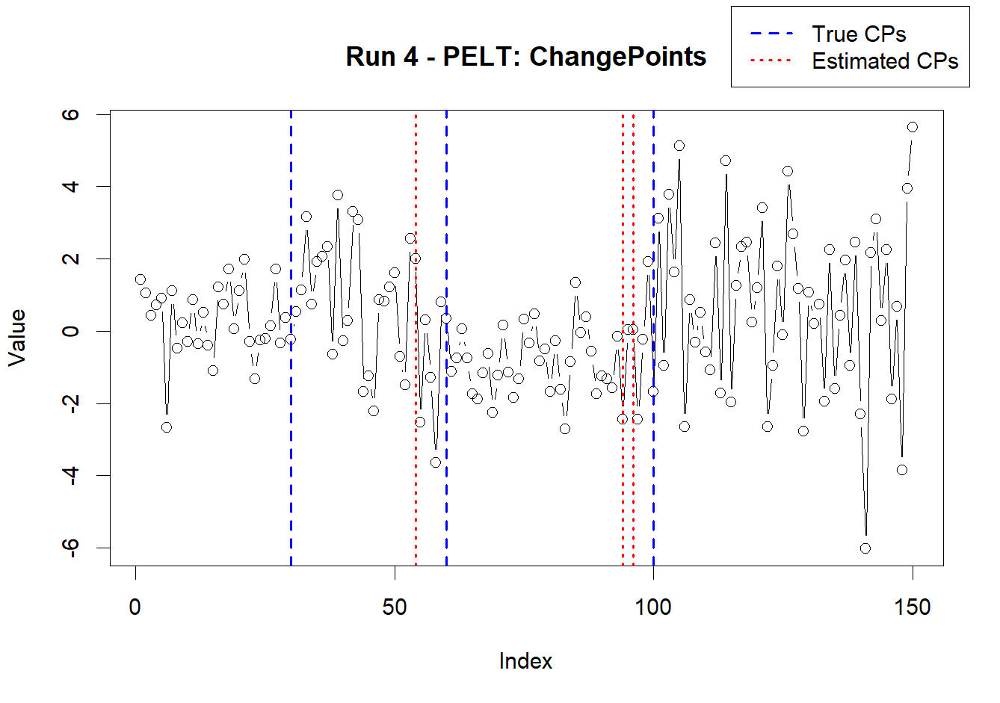

# Estimation-of-Change-Point-Detection-Algorithms

# Simulation Study for Change Point Detection in Time Series

This repository contains a collection of R scripts developed as part of my dissertation. The simulation study focuses on evaluating change point detection methods for time series data. Three families of methods are considered:

1. **Change in Mean Detection** using `cpt.mean`
2. **Change in Variance Detection** using `cpt.var`
3. **Change in Mean and Variance Detection** using `cpt.meanvar`

Different detection methods (PELT and BinSeg) and various penalty criteria (AIC, BIC, MBIC) are applied. The study involves simulating piecewise-stationary data with known change points and evaluating the performance of each method.

---

## Repository Structure

- **PBS-SCP-MEAN.R**  
  - **Purpose:** Single change point (SCP) detection in mean.  
  - **Highlights:**  
    - Simulates data with two segments (one mean shift).
    - Implements single change point detection using `cpt.mean` with both PELT and BinSeg (with Q set to 1).
    - Includes repeated simulation functions and sensitivity analyses (with and without MAD normalization).
  - **Example Code:**  
    ```r
    fit <- cpt.mean(data_vector, method = "PELT", penalty = "BIC")
    cpts(fit)  # Extracts the change point index
    ```
  - **Plots:**  
    <table>
      <tr>
        <td></td>
        <td></td>
        <td></td>
      </tr>
    </table>
    *Figure: Single change point detection in mean using both standard and MAD normalized data.*

- **PBS-MCP-MEAN.R**  
  - **Purpose:** Multiple change point (MCP) detection in mean.  
  - **Highlights:**  
    - Simulates data with four segments (multiple mean shifts).
    - Contains functions for repeated simulations and sensitivity analysis (varying the magnitude of the mean shift under different noise conditions).
    - Generates comparative 2×2 plots for penalty methods (AIC, BIC, MBIC).
  - **Example Code:**  
    ```r
    fit <- cpt.mean(data_vector, method = "BinSeg", penalty = "MBIC", Q = 15)
    cpts(fit)
    ```
  - **Plots:**  
    <table>
      <tr>
        <td></td>
        <td></td>
        <td></td>
      </tr>
    </table>
    *Figure: Multiple change point detection in mean with sensitivity analysis.*

- **PBS-MCP2.R**  
  - **Purpose:** Detection of two closely spaced change points in mean.  
  - **Highlights:**  
    - Simulates data with two closely spaced mean shifts.
    - Uses repeated simulations to evaluate how often both change points are detected and plots the average number of detected CPs against the gap value.
  - **Example Code:**  
    ```r
    sim_res <- simulate_two_close_cps_pelt(times = 100, n = 200, first_cp = 100, gap = 5, penalty = "MBIC")
    mean(sim_res$separated_2cps)
    ```
  - **Plots:**  
    <table>
      <tr>
        <td></td>
        <td></td>
        <td></td>
      </tr>
    </table>
    *Figure: Detection of two closely spaced change points in mean.*

- **PBS-SCP-VAR.R**  
  - **Purpose:** Single change point detection in variance.  
  - **Highlights:**  
    - Simulates data with two segments having a variance shift (constant mean).
    - Applies `cpt.var` with both PELT and BinSeg to detect the variance change.
  - **Example Code:**  
    ```r
    fit <- cpt.var(data_vector, method = "PELT", penalty = "BIC")
    cpts(fit)
    ```
  - **Plots:**  
    <table>
      <tr>
        <td align="center"></td>
        <td align="center"></td>
      </tr>
      <tr>
        <td align="center" colspan="2"><strong>PBS-SCP-VAR Results</strong></td>
      </tr>
    </table>

- **PBS-MCP-VAR.R**  
  - **Purpose:** Multiple change point detection in variance.  
  - **Highlights:**  
    - Simulates a time series with four segments having different variances.
    - Conducts repeated simulations and sensitivity analysis on variance shifts.
  - **Example Code:**  
    ```r
    fit <- cpt.var(data_vector, method = "BinSeg", penalty = "BIC", Q = 5)
    cpts(fit)
    ```
  - **Plots:**  
    <table>
      <tr>
        <td align="center"></td>
        <td align="center"></td>
        <td align="center"></td>
      </tr>
      <tr>
        <td align="center" colspan="3"><strong>PBS-MCP-VAR Results</strong></td>
      </tr>
    </table>

- **PBS-SCP-MEANVAR.R**  
  - **Purpose:** Single change point detection in both mean and variance.  
  - **Highlights:**  
    - Simulates data with two segments where both the mean and variance change.
    - Uses `cpt.meanvar` with both PELT and BinSeg to detect the boundary.
    - Sensitivity analyses are performed by varying the magnitude of the mean or variance shift.
  - **Example Code:**  
    ```r
    fit <- cpt.meanvar(data_vector, method = "PELT", penalty = "MBIC")
    cpts(fit)
    param.est(fit)$mean      # Estimated means
    param.est(fit)$variance  # Estimated variances
    ```
  - **Plots:**  
    <table>
      <tr>
        <td align="center">
          
        </td>
      </tr>
      <tr>
        <td align="center"><strong>PBS-SCP-MEANVAR Results</strong></td>
      </tr>
    </table>

- **PBS-MCP-MEANVAR-EST.R**  
  - **Purpose:** Multiple change point detection in both mean and variance.  
  - **Highlights:**  
    - Simulates a time series with four segments (three change points) where both the mean and variance differ.
    - Runs a simulation study (e.g., N = 1000) to assess the frequency of correctly detected CPs.
    - Summarizes the distributions of estimated segment means, variances, and CP locations.
  - **Example Code:**  
    ```r
    fit_pelt <- cpt.meanvar(x, method = "PELT")
    cpts(fit_pelt)
    param.est(fit_pelt)$mean
    param.est(fit_pelt)$variance
    ```
  - **Plots:**  
    <table>
      <tr>
        <td align="center">
          
        </td>
        <td align="center">
          
        </td>
      </tr>
      <tr>
        <td align="center" colspan="2"><strong>Multiple Change Points in Mean and Variance: BinSeg vs. PELT</strong></td>
      </tr>
      <tr>
        <td align="center" colspan="2">
          
        </td>
      </tr>
      <tr>
        <td align="center" colspan="2"><strong>Distribution of Estimated CP Locations</strong></td>
      </tr>
    </table>

---

## How to Run the Simulation Study

These R scripts were designed and executed as part of the simulation study conducted for my dissertation. They simulate piecewise-stationary time series data with known change points and apply different change point detection methods to estimate the locations and parameters of the changes.


## Prerequisites

Ensure that you have R (version 3.5 or later) installed along with the following package:

- **changepoint**  
  Install using:
  ```r
  install.packages("changepoint")
